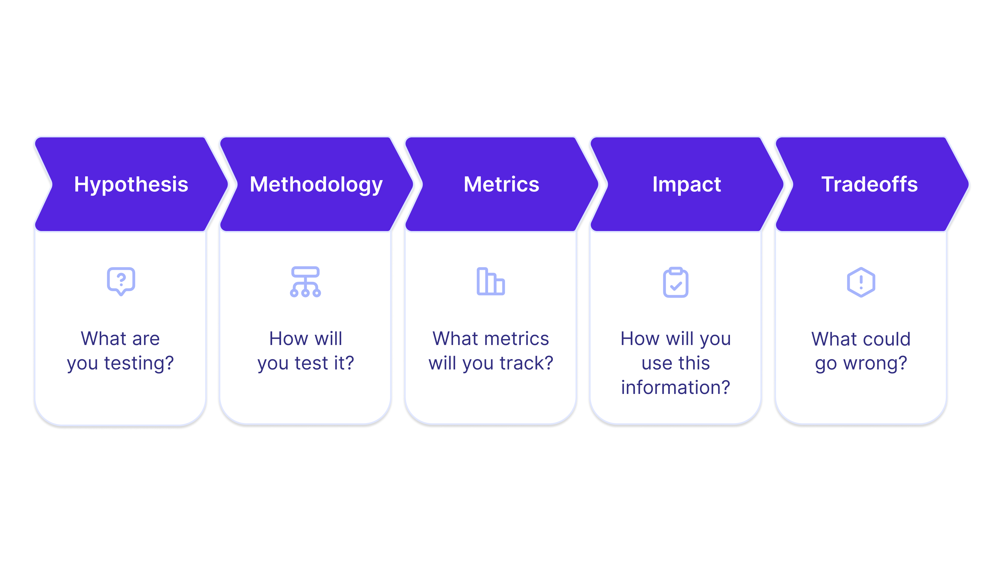

# How to Answer A/B Testing Questions

## 中文标题

如何回答 A/B 测试类问题

## Abbreviations and Terms

- A/B test: A/B testing，对照实验。通常将用户随机分为 control group 和 treatment group，比较不同产品方案对用户行为和业务指标的影响。
- PM: Product Manager，产品经理。
- CTR: Click-through Rate，点击率。通常计算方式为 clicks / impressions。
- Control: 对照组，看到当前体验或默认方案的用户组。
- Treatment: 实验组，看到新设计、新功能或改动方案的用户组。
- Cohort: 用户群组，指按某种规则划分出来的一组用户。
- Impression count: 曝光次数，指某个元素、页面或广告被展示的次数。
- Bounce rate: 跳出率。常见含义是用户进入某页面后没有进一步互动就离开的比例；在本文按钮例子里，指点击按钮进入新页面后的跳出情况。

## Framework From The Image

How to Answer A/B Testing Questions:

1. Hypothesis: What are you testing?
2. Methodology: How will you test it?
3. Metrics: What metrics will you track?
4. Impact: How will you use this information?
5. Tradeoffs: What could go wrong?

中文理解：

1. 假设：你到底要验证什么？
2. 方法：你准备如何设计实验？
3. 指标：你会追踪哪些指标？
4. 影响：你如何用实验结果做决策？
5. 权衡：这个方案可能带来什么问题？

## Core Summary

A/B testing questions evaluate whether you can use experiments to validate product decisions. A strong answer should define a clear hypothesis, describe a precise experiment setup, choose relevant metrics, explain how the results will affect the product decision, and discuss tradeoffs that may not be captured by metrics alone.

A/B 测试类问题考察的是你能否用实验验证产品决策。好的回答需要讲清楚：你要验证什么假设、如何设计实验、追踪哪些指标、如何根据实验结果做决策，以及哪些潜在风险无法完全通过数据捕捉。

## Original and Refined Notes

### Opening

#### Original

A/B tests are one of the core tools a product manager can employ for understanding user behavior. In fact, at many large tech companies, product managers are heavily involved with experimentation as a means to validate their product decisions.

This is why A/B testing-related questions are often asked in a product management interview. For example:

What experiments would you run on Google’s homepage to increase search queries?

What are the top 3 types of A/B Experiments you would run on Facebook ads to increase revenue?

Of course, there are simple structures to ace any PM interview, but an excellent experimentation interview answer will be sure to cover a few critical basics. Here’s the anatomy of a perfect A/B Test interview answer.

#### 中文润色

A/B 测试是产品经理理解用户行为的核心工具之一。事实上，在很多大型科技公司里，PM 会深度参与实验设计和实验分析，用实验来验证产品决策。

这也是为什么产品管理面试里经常出现 A/B 测试相关问题。例如：

- 你会在 Google 首页上做哪些实验来提升搜索查询量？
- 为了提升收入，你会优先在 Facebook ads 上做哪 3 类 A/B 实验？

当然，PM 面试有一些通用的答题结构。但如果想把实验类问题答得出色，必须覆盖几个关键要素。下面是一个优秀 A/B 测试面试答案的基本结构。

#### 复习注解

这段强调的是：A/B 测试不是“说一个改动再看数据”，而是产品决策验证机制。面试官想看你是否能：

- 用 hypothesis 明确实验目的
- 用 methodology 定义实验设计
- 用 metrics 衡量结果
- 用 impact 连接产品决策
- 用 tradeoffs 展示成熟判断

### 1. Hypothesis

#### Original

First, for any A/B experiment you propose, tell your interviewer what your hypothesis is. What are you actually even testing here? For example, perhaps you believe that by increasing the size of a button, it will increase the clickthrough rate (CTR).

#### 中文润色

首先，对于你提出的任何 A/B 实验，都要先告诉面试官你的假设是什么。你究竟想验证什么？

例如，你可能认为：如果把某个按钮变大，它的点击率 CTR 会提升。

#### 复习注解

Hypothesis 要尽量具体，最好能写成：

If we change X for user segment Y, then metric Z will improve because of reason R.

中文模板：

如果我们针对某类用户改变某个产品元素，那么某个关键指标会提升，因为这个改动解决了某个明确的用户问题或行为阻碍。

坏例子：

- “We test a bigger button.”

更好的例子：

- “We hypothesize that increasing the CTA button area by 50% will increase click-through rate because users will notice the primary action more easily.”

### 2. Methodology

#### Original

Now that we have a hypothesis, what exactly are we going to engineer differently to test this hypothesis? For instance, let’s run two cohorts of users. In the first cohort, the users will be our control, and will see exactly the same experience as present. In the second cohort, the users will see a button that is increased in area by 50%.

It’s important to be precise here. The interviewer needs to understand what exactly is being proposed, and what the experimental setup will look like. A big component of precision in methodology is defining who exactly the experiment is being run on. Are we targeting all users on the platform? Or should we pick a proper segment of users for whom we feel this test will be particularly well suited.

Don’t forget to add a control to your experiments — without a control, it’s impossible to actually gain useful insights from the data.

#### 中文润色

有了假设之后，就要说明你具体会怎样设计实验来验证这个假设。换句话说，我们到底要在产品里改什么？

例如，可以把用户分成两个 cohort。第一组是 control group，继续看到当前完全相同的体验。第二组是 treatment group，会看到一个面积增加 50% 的按钮。

这里的精确性非常重要。面试官需要清楚理解你提出的改动是什么，以及实验设置具体长什么样。方法设计中很重要的一点，是明确实验对象是谁。我们是面向平台上的所有用户做实验，还是应该选择一个更适合这个实验的用户 segment？

不要忘记设置 control group。没有对照组，就很难从数据中得到真正有用的结论。

#### 复习注解

Methodology 至少要讲清楚：

- Control group: 当前体验是什么
- Treatment group: 新体验具体改了什么
- User population: 哪些用户进入实验
- Segmentation: 是否需要按新老用户、地区、平台、流量来源等切分
- Randomization: 用户是否随机分组
- Duration: 实验大概需要跑多久
- Sample size: 是否需要足够样本量
- Exclusions: 是否排除异常用户、内部测试用户、机器人流量等

面试里不一定要展开统计细节，但一定要让实验设置听起来可执行、可比较、可解释。

### 3. Metrics

#### Original

Great, now we have an experimental setup. Next, you need to tell your interviewer what metrics you’ll be actually concerned with. What metrics will actually convey useful insights to your product and engineering teams?

In the button example, you’ll obviously want to be tracking CTR, but there are a few other metrics that might be relevant and are worth listing:

Impression count

CTR on other buttons on the page

Button hover time

Time spent on page

Bounce rate on the button’s clickthrough link (assuming the button leads to a new webpage)

To answer these questions, you’ll need to understand the goals of the experiment and anticipate potential pitfalls from launching the proposed redesign.

#### 中文润色

现在我们已经有了实验设置。接下来，你需要告诉面试官你真正关心哪些指标。哪些指标能给产品和工程团队提供有价值的洞察？

在按钮变大的例子里，你显然会追踪 CTR，但还有一些其他相关指标也值得列出：

- Impression count
- 页面上其他按钮的 CTR
- Button hover time
- Time spent on page
- 点击该按钮进入新页面后的 bounce rate，假设这个按钮会跳转到一个新网页

要回答好这类问题，你需要理解实验目标，并提前想到上线这个 redesign 可能带来的问题。

#### 复习注解

Metrics 不应该只列一个主指标。更完整的结构是：

- Primary success metric: 主要成功指标，例如目标按钮 CTR
- Secondary metrics: 辅助理解用户行为的指标，例如 hover time、time spent on page
- Guardrail metrics: 护栏指标，例如其他按钮 CTR 不能明显下降、bounce rate 不能上升、页面加载时间不能恶化
- Diagnostic metrics: 帮助解释结果的指标，例如 impression count、不同用户 segment 的表现

关键是把指标和实验目标对应起来，而不是机械堆指标。

### 4. Impact

#### Original

At the end of a day, running an experiment just tells us information. Tell your interviewer how this information will actually be useful. What metrics will you use to make an informed decision about whether or not to launch the proposed feature?

Perhaps you want to ensure that CTR increases with the redesign. Or perhaps the increased clicks on the button shouldn’t decrease the overall clicks of buttons on the page.

Ultimately, the answer to this question depends on the specific feature and the goal of the redesign. Here is a great opportunity to relate your answer to the overall vision and goals of the company.

#### 中文润色

归根结底，实验本身只是给我们提供信息。你需要告诉面试官，这些信息将如何真正帮助我们做决策。你会用哪些指标来判断是否应该上线这个功能或 redesign？

也许你希望 redesign 后 CTR 能提升。也许你还希望目标按钮点击增加的同时，不会导致页面上所有按钮的整体点击减少。

最终，这个问题的答案取决于具体功能和 redesign 的目标。这也是一个很好的机会，可以把你的回答连接到公司的整体愿景和目标。

#### 复习注解

Impact 部分要回答：“看到实验结果后，我们怎么行动？”

可以按结果分支来讲：

- If primary metric improves and guardrails are stable: launch or ramp up
- If primary metric improves but guardrails worsen: investigate tradeoff, iterate, or limit launch
- If primary metric does not improve: do not launch, analyze segments, revise hypothesis
- If results are mixed: segment analysis, longer test, qualitative research, or new experiment

更强的回答会把实验决策和业务目标连接起来，例如收入、留存、用户满意度、长期信任或生态健康。

### 5. Tradeoff

#### Original

Lastly, every proposed redesign or feature has some sort of tradeoff. What are some potential pitfalls to launching your proposed feature that might not be evident via a purely data-based analysis?

For example, perhaps, by making the button larger, you’ll increase the CTR on that button in question at the expense of other elements on the page. Some other great examples of points to make in typical A/B interview questions are qualities like “meaningful interactions” and user delight. These are not easily captured via metrics, and therefore are often missed in an overly quantitative mindset.

#### 中文润色

最后，每一个 redesign 或新功能都会带来某种 tradeoff。你需要思考：如果上线这个方案，可能有哪些潜在问题，是单纯依靠数据分析不容易发现的？

例如，把按钮变大也许会提高这个按钮本身的 CTR，但代价是削弱页面上其他元素的注意力和效果。在典型的 A/B 测试面试题里，还可以主动提到一些更难量化的因素，例如 meaningful interactions 和 user delight。这些不容易被指标完整捕捉，因此在过度量化的思维中常常被忽略。

#### 复习注解

Tradeoff 是展示产品成熟度的地方。可以从这些角度想：

- Local optimization vs overall experience: 局部指标提升是否伤害整体体验
- Short-term metric vs long-term trust: 短期点击提升是否损害长期信任
- Engagement vs quality: 更多互动是否真的是更有价值的互动
- Revenue vs user delight: 收入提升是否牺牲用户满意度
- Simplicity vs discoverability: 更显眼是否让页面更混乱
- Metric blind spots: 哪些重要体验无法被当前指标完全捕捉

## Interview Answer Template

When answering an A/B testing question, use this order:

1. State the hypothesis.
2. Define the control and treatment.
3. Specify the user population and segmentation.
4. Choose primary, secondary, and guardrail metrics.
5. Explain how you would interpret results and make a launch decision.
6. Discuss tradeoffs and risks beyond the metrics.

## Tags

ab-testing, experimentation, metrics, product-sense, analytical-questions
