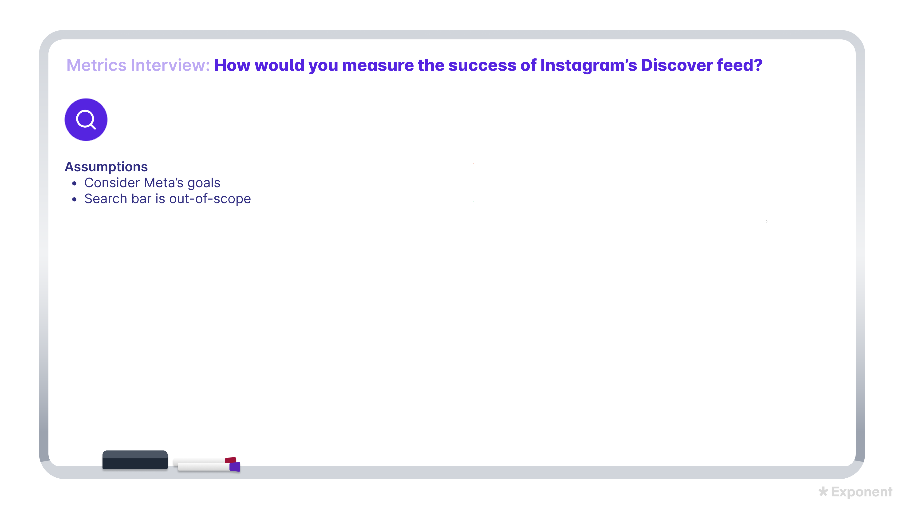
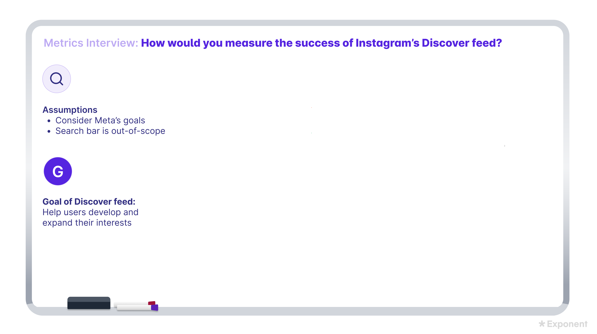
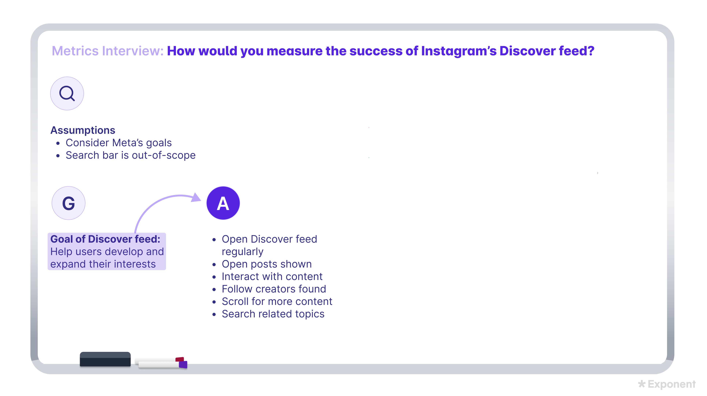
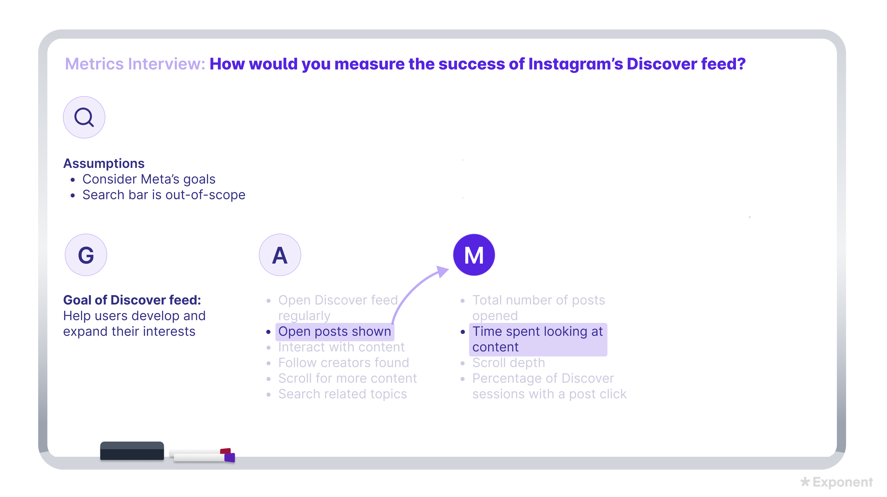
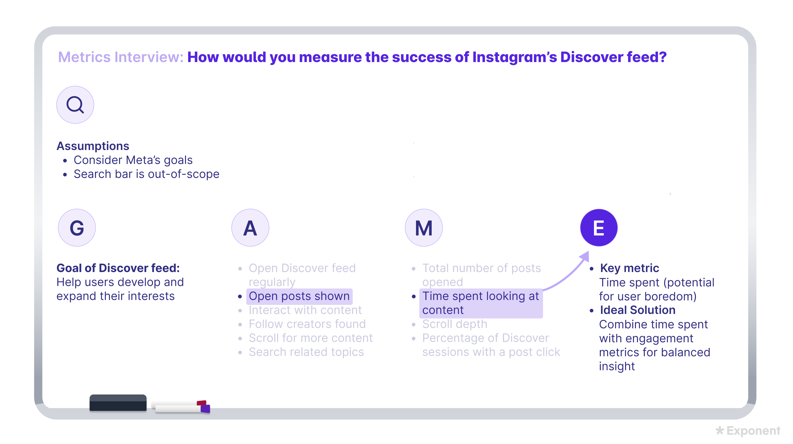

# How to Answer Metrics Questions

## Key Terms
- PM: Product Manager.
- KPI: Key Performance Indicator, a metric used to evaluate progress against an important goal.
- North star metric: The single metric that best summarizes product or business success.
- GAME framework: Clarify, Goals, Actions, Metrics, Evaluate.
- DAU: Daily Active Users.
- CTR: Click-through Rate, usually clicks divided by impressions.
- OKR: Objectives and Key Results, a goal-setting system that connects objectives to measurable outcomes.
- MTTR: Mean Time To Resolution, the average time needed to resolve an issue.

## Core Review

Do not start by listing DAU, retention, or revenue. First define what success means in this product context, then translate that success into user actions and measurable metrics.

The best answers explain why a metric fits the goal and where the metric can mislead.

## Core Summary

Metrics questions test whether you can define success in a specific product context, identify user actions that support that success, translate those actions into measurable metrics, and evaluate the strengths and weaknesses of your metric choices.

## Lesson Notes

### Opening

Expect to face two metrics questions over the course of a typical analytical PM interview. Each will last 20-25 minutes including follow-up questions.

Metrics questions are straightforward, but the scope of the question and the set of metrics you’ll be asked to identify can vary. For example, you might be asked to set metrics for a small feature or product, or for an entire company.

You may also be asked to identify a single north star metric, a set of KPIs, or a more general method for measuring feature/product/company success.

A north star metric is a single metric that best encapsulates success. Having a clear north star is helpful in aligning stakeholders, maintaining customer-centricity, and keeping analysis simple.

Common questions include:

“Define a north star metric for Airbnb.”

“What metrics would you measure as a PM launching a new feature on WhatsApp?”

“How do you define success metrics?”

Common follow-up questions include:

“What additional metrics besides your north star would be helpful to track?”

“Are there any blind spots or challenges associated with your chosen metrics?”

“What strategies can you think of for driving your metrics?”

### What Interviewers Are Looking For

What interviewers are looking for

Interviewers want to see you demonstrate that you can:

Set feature / product / company goals

Brainstorm, weigh, and select metrics relevant to the situation at hand

Apply product and strategic reasoning

The key to a solid answer is to spend time first defining what success really means in the context of your question as it’s critical to understand what you’re measuring and why. Interviewers will want to see that you can keep the larger goal in mind as you translate your insights into actionable metrics.

### The GAME Framework

The GAME framework for answering metrics questions

We recommend the GAME framework as an effective method for moving through metrics questions. This framework offers a clear structure and helps you build a strong justification for your final answer as you go.

The steps are:

Step 1: Clarify

Step 2: Goals

Step 3: Actions

Step 4: Metrics

Step 5: Evaluate

How to Answer Metrics Questions Framework

### Example Setup

Let’s work through an example to illustrate. Assume you’ve been asked:

”How would you measure the success of Instagram’s Discover feed?”

#### Example

Question: How would you measure the success of Instagram’s Discover feed?

### Step 1: Clarify

Step 1: Clarify

Clarify any ambiguity in the question and state your assumptions first. This way, you’ll ensure you’re on track as you begin to build out your answer.

If you’re unsure what to ask, clarify what’s in scope for any company names or products you’re given. For example, should you be considering the single entity in question or the whole parent company? If you’re asked to define success for a product, are there any features you should focus on?

Example

For our example question "How would you measure the success of Instagram’s Discover feed?” clarifying questions you might ask your interviewer include:

“Should I be considering Meta’s goals as the parent company of Instagram?”

“Should I include the search bar in the Discover feed in this analysis?”

Let’s assume the interviewer says that you should consider Meta’s goals and that the search bar is out-of-scope for now.How to Answer Metrics Questions Whiteboard 1

#### Example

Clarifying questions:

- Should I be considering Meta’s goals as the parent company of Instagram?
- Should I include the search bar in the Discover feed in this analysis?

Assumptions after interviewer response:

- Consider Meta’s goals.
- Search bar is out-of-scope.

### Step 2: Goals

Step 2: Goals

Next, begin defining the main goals for the company, product, or feature. You’ll refer back to this goals analysis throughout your answer. Here are some common prompts to think about as you define goals:

What is the product vision? Learn more about product vision in the product design lesson.

What is this product’s point of view? In other words, what does this specific product do for the larger company and for its users?

The company mission offers a lot of insight. If you don’t know the company mission off-hand it’s safe to make an assumption of what you think it might be, as long as you communicate that to your interviewer.

Example

For our example question "How would you measure the success of Instagram’s Discover feed?" Let’s assume you don’t know Meta’s mission offhand.

Given its portfolio of technologies (Facebook, Instagram, Messenger, WhatsApp, etc). it is safe to assume that Meta’s mission includes key concepts like communication, sharing, and community-building.

Extending those concepts to Instagram, and Instagram’s Discover feed, you might say the following to your interviewer:

"I am assuming that Meta’s mission is to give people the power to build community. The Discover feed is an interest-based feed that shows users content they wouldn’t find otherwise, which supports Meta’s mission by exposing users to new parts of the world.

For now, I’ll claim that the goal of the Discover feed is “Help users develop and expand their interests."How to Answer Metrics Questions Whiteboard 2

#### Example

Assumed Meta mission: give people the power to build community.

Discover feed role: an interest-based feed that shows users content they would not otherwise find.

Goal: Help users develop and expand their interests.

### Step 3: Actions

Step 3: Actions

Once you’ve settled on a clear goal, it’s time to build a list of actions you want to see users take in support of that goal. Questions to ask yourself include:

What actions or behaviors do we want to see from our users that support these goals?

What could we point to as evidence that the product goal is being achieved?

A common technique for building this list of relevant actions is to run through a user journey map.

Note

A user journey map or a user funnel is a process flow that covers every step that a user would take to accomplish a certain goal. A full walk-through of a software product would include every screen that user sees, every decision point, and every click they make.

Building a user journey map is helpful in that it makes your options explicit. Once you build your map, you can select the actions that drive your goal, and choose metrics that measure these later in your answer. There are two key steps to building a user journey map:

1) Pick a use case for the product that you want to analyze.

Choose a use case where the user’s goal aligns with the goal you have in mind for the product. A common mistake in interviews is to try to map multiple use cases at once to save time. It’s easy to confuse yourself following different user behaviors. Instead, if necessary, walk through multiple user journeys.

2) Walk through the steps that the user takes to achieve their goals.

Once you have a clear use case chosen where you can state the user’s goals, begin listing the steps they take as they interact with your product. Start from wherever the user enters the product, and list every screen, decision point, and click. Be sure to define a clear “endpoint” to the journey. This can be time-consuming, so it’s important to use your judgment as a PM to gloss over details that aren’t important to the question at hand.

As you progress through the journey, take note of any essential steps or desired user behaviors that support the goal you’ve defined above. You’ll likely generate metrics to track these actions in the next step.

Example

Let’s build a user journey map for our example question "How would you measure the success of Instagram’s Discover feed?”

Recall that you’ve stated the goal of the Discover feed is to help users develop and expand their interests.

Let’s assume you want to map the use case in which the user’s desired outcome is to be entertained by new content for a short period. This is realistic, and it aligns with your stated goal for the Discover feed. The user journey map includes the following actions:

The user opens Instagram and is shown the Home feed.

The user clicks on the Discover tab and is shown the Discover feed, with a grid of posts and Reels. A search bar and suggestions for interesting topics sit at the top of the page.

The user could search at this point (recall our interviewer stated that search is out of scope for this question).

Otherwise, the user can scroll as much as they want.

At some point, they may click on a post or Reel, which will expand it.

They could continue on from there as they could with any other post or Reel. liking, commenting, visiting the poster’s profile, etc.

They could also come back to the feed.

The journey ends when the user exits the app or switches to a different part of the product. This will happen when the user feels satisfied, gets bored or frustrated, or gets interrupted (e.g. their train ride ends).

From this user journey map, you’d want to identify key actions that indicate that users are developing and expanding their interests through the Discover feed. These key actions would include:

Open the Discover feed regularly

Open the posts we show them

Like, comment on, or share content we show them there

Follow creators they find there

Scroll for more content

Search for related topicsHow to Answer Metrics Questions Whiteboard 3

#### Note

#### Example

Example goal: help users develop and expand their interests through Discover feed.

Use case: user wants to be entertained by new content for a short period.

User journey:

- User opens Instagram and sees Home feed.
- User clicks Discover tab and sees Discover feed with posts and Reels.
- User could search, but search is out-of-scope.
- User scrolls.
- User clicks a post or Reel.
- User may like, comment, visit profile, or take other post/Reel actions.
- User may return to the feed.
- Journey ends when user exits the app or switches to another product area.

Key actions:

- Open the Discover feed regularly.
- Open the posts shown in Discover.
- Like, comment on, or share content shown there.
- Follow creators found there.
- Scroll for more content.
- Search for related topics.

### Step 4: Metrics

Step 4: Metrics

Once you’ve identified key actions users should take, it’s time to build out a list of relevant metrics to track these key actions. If you sense that some key actions are more critical than others, explain your thought process and brainstorm metrics specifically for those actions.

Another helpful strategy is to brainstorm a list of five to ten metrics that capture your key actions, then whittle that down to one to three depending on the specifics of your question.

Be sure to explain every step of your process to your interviewer, including any actions that you end up ignoring, or metrics that seemed useful during your initial brainstorm, but don’t make the final cut.

Here’s a quick review of commonly-used metrics.

Product metrics

Product metrics capture how users interact with your product. They are helpful for understanding user behavior and making product decisions. These metrics are typically the most important for PMs in their day-to-day work, and they are likely the metrics you’ll focus on most.

However, it's crucial to interpret them with proper context, as factors like product changes, seasonality, and external events can influence them.

Common product metrics include: Daily Active Users (DAU), Click-Through Rate (CTR), Time Spent

Objectives and key results (OKRs)

OKRs connect strategic objectives to quantifiable key results, helping align teams and track progress. Although they’re critical because they support strategic initiatives, they are purposefully limited in scope, so these key results may not capture the overall health or growth of a business.

OKRs are usually the north star for a PM.

Common key results include: Acquired users in specific markets, DAU growth for a product, Churn reduction

Business metrics

Business metrics are high-level indicators that track the overall performance of a company. These metrics usually provide the clearest "true north" when assessing business health. However, they are usually lagging indicators and it may be difficult for small features to impact them meaningfully, making them less useful for tactical decision-making.

Common business metrics include: Revenue, Net profit margin, Customer lifetime value

Quality metrics

Quality metrics monitor how well a process or product is functioning. They can measure either internal or external aspects of a product or service.

Common quality metrics include: The size of a bug backlog, Mean time to resolution (MTTR), Page load time

Leading indicators

Leading indicators supplement real-time decision-making and are typically more variable and sensitive to change. Many product metrics also function as leading indicators. To provide a comprehensive understanding, leading indicators should be used in conjunction with more solid lagging indicators.

Common leading indicators include: User signups, Button clicks

Counter (or guardrail) metrics

Sometimes, driving one metric results in a drop in another important area. Counter metrics ensure that driving towards one goal doesn't compromise other priorities.

These are used alongside other metrics to complete the overall picture.

Common counter metrics include: Churn rate, Customer satisfaction scores (when used in conjunction with product metrics).

Example

Returning to our example question "How would you measure the success of Instagram’s Discover feed?”

Recall that you’ve come up with the following list of key actions that indicate that users are developing and expanding their interests through the Discover feed.

Open the Discover feed regularly

Open the posts we show them

Like, comment on, or share content we show them there

Follow creators they find there

Scroll for more content

Search for related topics

Your metrics brainstorm would include:

"In order for users to develop and expand their interests through the Discover feed, they need to open the feed regularly and interact with the content in some way. I believe opening posts users have been shown on the Discover feed is critical.

There are multiple ways to measure how users are opening posts from the Discover feed. For instance:

We could measure the total number of posts opened by user.

We could measure the time spent looking at the content by user per session.

Similar to time spent, we could measure scroll depth per session per user.

We could also measure the percentage of Discover sessions with a post click.

Each of these options tells me something slightly different. Returning to my stated goal - if I want to know that users are developing their interests, I would choose time spent by user per session as my metric, as it also captures depth of interest.”How to Answer Metrics Questions Whiteboard 4

#### Example

For Instagram Discover feed, key actions include:

- Open the Discover feed regularly.
- Open the posts shown.
- Like, comment on, or share content.
- Follow creators found there.
- Scroll for more content.
- Search for related topics.

Metrics brainstorm:

- Total number of posts opened by user.
- Time spent looking at content by user per session.
- Scroll depth per session per user.
- Percentage of Discover sessions with a post click.

Chosen metric:

Time spent by user per session, because it captures depth of interest.

### Step 5: Evaluate

Step 5: Evaluate

All metrics are strong in some areas and weak in others. As you evaluate your choice, describe the tradeoffs of different metrics you considered.

The main thing to evaluate is whether your chosen metric is good enough to measure the key action(s) you’re looking for in support of your goal. To do that, ask yourself “Where does my metric fall short?”

Another area that interviewers like to dive into in follow-up questions is what to do about the inherent weaknesses in whatever metric you’ve chosen.

Not all weaknesses need to be addressed. It may simply be something you need to be aware of as a PM. If an issue is worth mitigating, explain what you’d do to your interviewer. Often, setting up counter metrics will help you stay confident that the user experience isn’t degrading somewhere else.

Example

Wrap up your answer by evaluating your choice:

"I chose time spent as my key metric, but I can see a case where users spend a lot of time on the Discover feed because they’re bored and are looking for something interesting but they haven’t found it yet.

Ideally, I would like to couple time spent with a counter metric that measures a user's engagement in the content such as likes or creators followed from the Discover feed."How to Answer Metrics Questions Whiteboard 5

#### Example

Evaluation of chosen metric:

“I chose time spent as my key metric, but I can see a case where users spend a lot of time on the Discover feed because they’re bored and are looking for something interesting but they haven’t found it yet.

Ideally, I would like to couple time spent with a counter metric that measures a user's engagement in the content such as likes or creators followed from the Discover feed.”

### Okay vs Good vs Great Answers

“Okay” vs. “good” vs. “great” answers

An okay answer gives a broad explanation of what the goals of the product are. The candidate lists out feasible metrics that measure most of the important aspects of the product and gives a reasonable justification for choosing one as a north star.

A good answer gives a clear sense of the product’s goals, based on reasonable product or strategic insights. The candidate explains what actions and behaviors would show that these goals are being met, then finds metrics to measure those actions. The north star metric is clearly tied to the goal. The candidate understands where their metrics might be misleading and can suggest guardrails and alternate metrics to keep an eye on.

A great answer finds a deep understanding of the product and why it exists, possibly touching on its users, how it supports the company's strategic goals, the market, or other aspects. Based on this, the candidate articulates specific goals that clearly communicate what is important about this product. The candidate has a good sense of what they need to understand about the product and can translate that into actions and then metrics. The candidate is comfortable thinking about how actions can be translated into metrics and what it would entail to capture these metrics. The north star metric is clear and the justification feels deeply tied to the goal and possibly larger success of the organization.

### Common Pitfalls

Common pitfalls

Answer the interviewer's question. If they asked for one north star metric, don't end up with three options due to indecision.

Make sure your answer is an actual metric. Particularly, don’t use "engagement" as your north star metric. Engagement is not a metric; it’s a class of metrics. If engagement is important, specify what you actually want to measure (e.g., DAU, time spent, purchases) and why.

Clarify how your metric is measured if it's not obvious. If your north star is DAU, what makes a user “active”? If the metric is time spent, is that per session? Per user per month?

Make sure your metric actually gives you the information you need. A small feature’s effect on the whole product’s DAU will likely be drowned out by noise, so overall DAU may not be a useful metric for that feature.

metrics, game-framework, north-star-metric, kpi, okr, analytical-questions, product-sense
