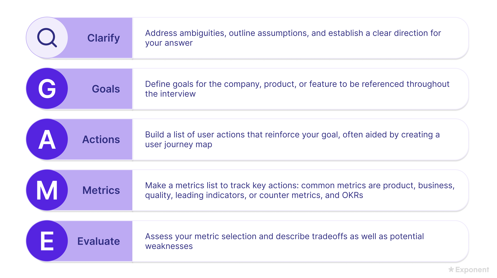

# 如何回答指标类问题

## 关键术语
- PM：产品经理。
- KPI：关键绩效指标，用来衡量重要目标的推进情况。
- 北极星指标：最能概括产品或业务成功的单一核心指标。
- GAME 框架：指标题回答框架，完整步骤是澄清问题、定义目标、梳理用户行为、选择指标、评估指标。
- DAU：日活跃用户数。
- CTR：点击率，通常等于点击次数除以曝光次数。
- OKR：目标与关键结果。
- MTTR：平均解决时间。

## 核心复习

不要一上来就说日活、留存或收入。先定义这个产品场景里的成功是什么，再把成功转化为用户行为和可衡量指标。

最好的答案不仅说明为什么某个指标适合目标，也会说明这个指标可能在哪里误导判断。

如何回答指标类问题

## 核心总结
指标类问题考察的是：你能否在具体产品语境中定义“成功”，找出支撑成功的用户行为，把这些行为转化成可衡量指标，并评估所选指标的优缺点。
## 课程笔记
### 开篇

在典型的分析类 PM 面试中，你可能会遇到两道指标题。每道题通常持续 20 到 25 分钟，其中包括追问。

指标题本身比较直接，但问题范围和需要识别的指标类型会有所不同。例如，面试官可能让你为一个小功能、一个产品，甚至整家公司设定指标。

你也可能被要求定义一个单一的 north star metric、一组 KPI，或者提出一种更通用的方法，用来衡量某个功能、产品或公司的成功。

North star metric 是最能概括成功的单一指标。清晰的北极星指标有助于对齐 stakeholders，让团队保持 customer-centricity，并让分析更简单。

常见问题包括：

- 为 Airbnb 定义一个北极星指标。
- 作为即将在 WhatsApp 上推出新功能的 PM，你会衡量哪些指标？
- 你如何定义 success 指标？

常见追问包括：

- 除了你的 north star metric，还有哪些额外指标值得追踪？
- 你选择的指标有什么盲点或挑战？
- 你能想到哪些策略来推动这些指标？

#### 复习注解

这段的关键是：指标题经常要求你从“目标”出发，而不是从“指标清单”出发。好的答案要先定义成功，再选择指标。

面试官希望看到你能展示以下能力：

- 为 feature、product 或 company 设定目标。
- 根据当前场景 brainstorm、权衡并选择相关指标。
- 运用产品判断和战略推理。

一个扎实答案的关键，是先花时间定义：在这道题的语境中，“成功”到底意味着什么。只有先理解你要衡量什么、为什么要衡量，后面选指标才有依据。面试官希望看到你在把洞察转化为可执行指标时，始终没有丢掉更大的目标。

#### 复习注解

指标题的底层逻辑：

Goal -> User actions -> 指标 -> Evaluation

不要直接开口说 DAU、retention、revenue。先解释你认为产品要达成什么目标。

### GAME 框架

回答指标题时，Exponent 推荐使用 GAME framework。这是一个有效推进指标题的结构，能够帮助你一边展开答案，一边为最终指标选择建立清晰依据。

GAME 的五步是：

1. Clarify：澄清问题。
2. Goals：定义目标。
3. Actions：找出支撑目标的用户行为。
4. 指标：把用户行为转化成可衡量指标。
5. Evaluate：评估指标选择的优缺点。

图片一是 GAME framework 的总览。

#### 复习注解

GAME 的好处是避免“凭感觉选指标”。它强迫你把指标和目标、用户行为连接起来。

下面用一个例子来说明。假设面试官问你：

“你会如何衡量 Instagram Discover feed 的成功？”

### 第一步：澄清问题

第一步是 Clarify。你需要先澄清题目中的模糊点，并说明自己的 assumptions。这样可以确保你在展开答案之前，方向没有偏。

如果你不确定该问什么，可以先澄清题目中公司名或产品名的 scope。例如，你应该只考虑题目中提到的单个产品，还是也要考虑母公司的整体目标？如果题目要求你定义某个产品的成功，是否有某些特定功能需要重点关注？

对于例题 “How would you measure the success of Instagram’s Discover feed?”，你可以问：

- 我是否应该考虑 Instagram 母公司 Meta 的目标？
- 在这个分析中，我是否应该把 Discover feed 里的 search bar 也包含进来？

假设面试官回答：你应该考虑 Meta 的目标，但 search bar 暂时不在 scope 内。

图片二是 Clarify 阶段的白板。

### 第二步：定义目标

第二步是 Goals。你需要定义公司、产品或功能的主要目标。后面整个答案都应该不断回到这个目标分析上。

定义目标时，可以思考：

- 产品愿景是什么？产品愿景会在 product design 课程里进一步展开。
- 这个产品的 point of view 是什么？换句话说，这个具体产品为更大的公司目标和用户分别提供什么价值？
- 公司使命通常能提供很多线索。如果你不知道公司的官方 mission，也可以做一个合理假设，只要你明确告诉面试官这是你的假设。

对于例题，假设你一时不知道 Meta 的官方 mission。

考虑到 Meta 的产品组合包括 Facebook、Instagram、Messenger、WhatsApp 等，可以合理假设 Meta 的 mission 包含 communication、sharing、community-building 等核心概念。

把这些概念延伸到 Instagram 和 Instagram Discover feed，你可以对面试官说：

“我假设 Meta 的使命是赋予人们建立 community 的能力。Discover feed 是一个 interest-based feed，它向用户展示他们原本不会发现的内容。因此，它通过让用户接触世界中新的部分来支持 Meta 的使命。

所以目前我会把 Discover feed 的目标定义为：Help users develop and expand their interests。”

图片三是 Goals 阶段的白板。

### 第三步：梳理用户行为

第三步是 Actions。有了清晰目标之后，你需要列出哪些用户行为能支持这个目标。

你可以问自己：

- 我们希望用户采取哪些行动或表现出哪些行为，来支持这些目标？
- 哪些行为可以作为产品目标正在达成的证据？

建立这类行为列表的常见方法，是走一遍 user journey map。

### 第四步：选择指标

第四步是 指标。识别出关键用户行为之后，就要建立一组相关指标来追踪这些行为。

如果你感觉某些关键行为比其他行为更重要，就要解释你的思考过程，并专门围绕这些行为 brainstorm 指标。

另一个有效策略是：先 brainstorm 5 到 10 个能捕捉关键行为的指标，然后根据题目要求缩小到 1 到 3 个。

一定要向面试官解释你的每一步过程，包括你最后忽略了哪些 actions，或者哪些指标一开始看起来有用，但最终没有入选。

常见指标类型包括：

- Product 指标：捕捉用户如何与产品互动，帮助理解用户行为和做产品决策。常见例子包括 DAU、CTR、Time Spent。
- OKRs：把战略目标和可量化 key results 连接起来，帮助团队对齐并追踪进度。OKRs 对战略很重要，但范围有意限制，不一定能反映整体业务健康或增长。PM 的 north star 往往会和 OKR 有关。
- Business 指标：衡量公司整体表现的高层指标。它们通常最接近 business health 的 true north，但往往是 lagging indicators，小功能很难显著影响它们，所以对战术决策不一定有用。例子包括 revenue、net profit margin、customer lifetime value。
- Quality 指标：衡量流程或产品运行质量，可以是内部或外部质量。例子包括 bug backlog size、MTTR、page load time。
- Leading indicators：支持实时决策，通常更敏感、更容易波动。很多 product 指标 也可以作为 leading indicators。为了形成完整理解，leading indicators 应和更稳固的 lagging indicators 一起使用。例子包括 user signups、button clicks。
- Counter 或 guardrail 指标：当推动一个指标可能伤害另一个重要领域时，用 counter 指标 确保追求某个目标不会牺牲其他优先级。例子包括 churn rate、customer satisfaction scores。

### 第五步：评估指标

第五步是 Evaluate。所有指标都有强项和弱点。评估指标选择时，要描述你考虑过的不同指标之间的 权衡。

最重要的是判断：你选择的指标是否足够好，能否衡量支持目标的关键行为。你可以问自己：“我的指标在哪些地方会失效？”

面试官也经常在追问中深入：既然你选的指标有天然弱点，你会如何处理？

并不是所有弱点都必须解决。有些弱点只是 PM 需要意识到的背景风险。如果某个问题值得缓解，你就要告诉面试官你会怎么做。很多时候，设置 counter 指标 能帮助你确认用户体验没有在其他地方变差。

Okay answer：能大致解释产品目标。候选人列出一些可行指标，覆盖产品大部分重要方面，并能为某个 north star metric 给出合理理由。

Good answer：能基于合理的产品或战略洞察，清楚说明产品目标。候选人能解释哪些 actions 和 behaviors 可以证明这些目标正在达成，然后找到衡量这些 actions 的 指标。North star metric 和目标之间联系清楚。候选人也理解自己的指标可能在哪些地方误导，并能提出 guardrails 和 alternate 指标。

Great answer：体现出对产品及其存在理由的深刻理解，可能涉及用户、产品如何支持公司战略目标、市场位置等。在此基础上，候选人能提出具体目标，清楚表达这个产品最重要的价值。候选人知道自己需要理解产品的哪些方面，并能把这些理解转化为 actions，再转化为 指标。候选人能自如地思考如何把用户行为转化成指标，以及捕捉这些指标意味着什么。North star metric 清晰，理由和产品目标、甚至组织层面的成功深度绑定。

#### 复习注解

Great answer 的核心差异是深度和连贯性：

Product purpose -> Strategic goal -> User behavior -> Metric -> Weakness and guardrail

### 常见错误

常见错误：

- 回答面试官真正问的问题。如果对方要求一个 north star metric，不要因为犹豫不决最后给三个选项。
- 确保你的答案是真正的 metric。尤其不要把 “engagement” 直接当作 north star metric。Engagement 不是一个具体指标，而是一类指标。如果 engagement 很重要，你要明确你到底想衡量什么，例如 DAU、time spent、purchases，并说明为什么。
- 如果指标的衡量方式不明显，要说明清楚。如果你的 north star 是 DAU，什么样的用户算 active？如果指标是 time spent，是 per session，还是 per user per month？
- 确保指标真的能提供你需要的信息。小功能对整个产品 DAU 的影响很可能被噪音淹没，所以 overall DAU 可能不是评估这个功能的有用指标。

#### 复习注解

指标题最容易犯的错误是：

- 没有回答题目要求的数量和类型。
- 说的是概念，不是指标。
- 没有定义指标计算口径。
- 指标粒度和功能范围不匹配。
- 只说 north star，不说 blind spots 和 guardrails。
