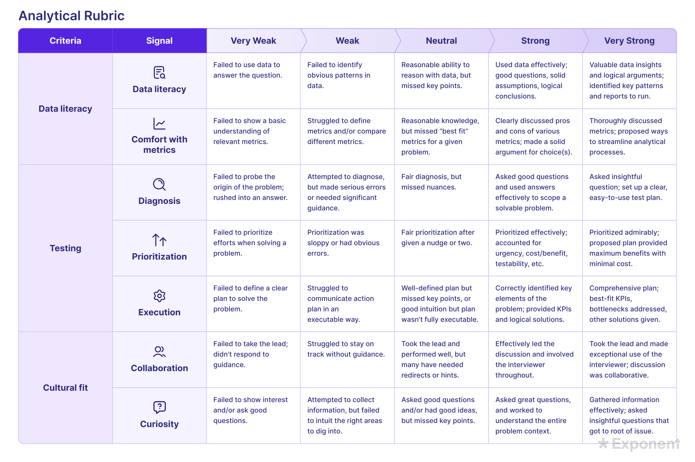

# Rubric for Analytical Interviews

## 中文标题

分析类面试评分标准

## Source

Exponent lesson: Rubric for Analytical Interviews

## Abbreviations and Terms

- PM: Product Manager，产品经理。
- KPI: Key Performance Indicator，关键绩效指标。
- Data literacy: 数据素养，指理解、分析和使用数据得出结论的能力。
- Culture fit: 文化契合度，指候选人与公司工作方式、沟通方式、价值观和协作习惯的匹配程度。
- Critical thinking: 批判性思维，指诊断问题、分析原因、评估优先级并制定行动计划的能力。
- Rubric: 评分标准或评分表。

## Image Asset

Use the original rubric image provided with this lesson for the future website.

Expected path:

- `product-sense/assets/images/analytical-questions/rubrics/analytical-rubric.png`

## Core Summary

Analytical interviews are scored across analytical skills, critical thinking, and culture fit. The strongest candidates do more than reach a correct answer: they use data, choose metrics thoughtfully, diagnose problems, prioritize effectively, execute a clear plan, communicate proactively, collaborate with the interviewer, and show genuine curiosity.

分析类面试不只是看你有没有“答案”。评分通常覆盖分析能力、批判性思维和文化契合度。强候选人会展示数据能力、指标判断、问题诊断、优先级排序、执行计划、清晰沟通、协作意识和好奇心。

## Original and Refined Notes

### Opening

#### Original

Rubric for Analytical Interviews

Note: For more detail on how Exponent's interview rubrics work, check out this lesson.

Now that you know how to answer analytical questions, let's look at how they're scored.

PM Analytical Rubric

图片1

#### 中文润色

分析类面试评分标准

Note：如果想更详细了解 Exponent 的面试评分标准如何运作，可以查看对应课程。

现在你已经知道如何回答分析类问题了，接下来看看这些回答是如何被评分的。

PM Analytical Rubric

图片一是分析类 PM 面试的 rubric 总览。

#### Note Callout

Type: note

This lesson explains how analytical interview answers are scored, not just how they are structured.

### Core Skills to Show in Analytical Interviews

#### Original

Core Skills to Show in Analytical Interviews

Analytical questions generally assess analytical skills, critical thinking and culture fit. Companies often use a scoring system with five options ranging from "missing" or "very weak" to "very strong." Interviewers score core qualities on this five-point scale during each round, and take turns sharing their feedback during the hiring discussion.

Analytical skills include data literacy (can you work with data?) and comfort with metrics (can you choose and interpret the right metrics for a given problem?)

Critical thinking skills include the ability to diagnose problems, the ability to prioritize, and the ability to execute a plan.

Culture fit signals include communication, collaboration, and curiosity.

Let's dive into each.

#### 中文润色

分析类面试中需要展示的核心技能

分析类问题通常评估三大方面：analytical skills、critical thinking 和 culture fit。公司经常使用五级评分体系，从 “missing” 或 “very weak” 到 “very strong”。每轮面试中，面试官会用这个五分制给核心能力打分，并在 hiring discussion 中轮流分享反馈。

Analytical skills 包括 data literacy，也就是你能否处理和分析数据；以及 comfort with metrics，也就是你能否为特定问题选择并解读合适指标。

Critical thinking skills 包括诊断问题、确定优先级和执行计划的能力。

Culture fit signals 包括 communication、collaboration 和 curiosity。

下面逐项展开。

### Data Literacy

#### Original

Data Literacy

Working with data is a core PM skill. Interviewers are looking for how you analyze data; whether you can identify patterns, suggest tests to run, and draw reasonable conclusions.

Very Weak or Missing: Failed to use data to answer the question.

Weak: Failed to identify obvious patterns in data.

Neutral: Fair ability to reason with data, but missed key points.

Strong: Used data effectively; asked good questions, made solid assumptions, formed logical conclusions.

Very Strong: Extracted valuable insights from data; identified key patterns, suggested reports/tests to run, made logical arguments.

#### 中文润色

数据素养

处理数据是 PM 的核心能力。面试官会观察你如何分析数据：你是否能识别数据中的 patterns，提出应该运行的 tests，并得出合理结论。

- Very Weak or Missing：没有使用数据回答问题。
- Weak：没有识别出数据中明显的 patterns。
- Neutral：具备基本的数据推理能力，但遗漏了关键点。
- Strong：有效使用数据；提出好问题，做出合理假设，并形成逻辑结论。
- Very Strong：从数据中提取有价值的洞察；识别关键 patterns，提出应运行的 reports/tests，并形成有逻辑的论证。

### Comfort with Metrics

#### Original

Comfort with Metrics

A working knowledge of common metrics around core data like user acquisition, retention and usage is critical. Even more important is knowing when to use one metric versus another - and what insights you draw from each.

Very Weak or Missing: Failed to show a basic understanding of relevant metrics.

Weak: Struggled to define metrics for given problems and/or compare different metrics.

Neutral: Reasonable knowledge, but missed "best fit" metrics for a given problem.

Strong: Clearly discussed pros and cons of various metrics, made a solid argument for choice(s).

Very Strong: Metrics thoroughly and accurately discussed, recommended ways to streamline analytical processes.

#### 中文润色

指标运用能力

你需要掌握围绕 user acquisition、retention、usage 等核心数据的常见指标。更重要的是，你要知道什么时候该用某个指标而不是另一个指标，以及每个指标能带来什么 insight。

- Very Weak or Missing：没有展示对相关指标的基本理解。
- Weak：难以为给定问题定义指标，或难以比较不同指标。
- Neutral：具备合理知识，但没有选出当前问题的 best-fit metrics。
- Strong：清楚讨论不同指标的优缺点，并为自己的选择给出有力论证。
- Very Strong：全面且准确地讨论指标，并提出简化分析流程的方法。

### Ability to Diagnose Problems

#### Original

Ability to Diagnose Problems

Understanding how to scope problems is critical to problem-solving in a business context. You have so much data available - it's key that you break down problems such that you can create an action plan.

Very Weak or Missing: Failed to probe the origin of the problem; rushed into an answer.

Weak: Attempted to diagnose, but made serious errors or needed significant guidance.

Neutral: Fair diagnosis, but missed nuances.

Strong: Asked good questions and used answers effectively to scope a solvable problem.

Very Strong: Asked insightful questions; set up a clear, easy-to-use test plan.

#### 中文润色

诊断问题的能力

在商业语境中解决问题时，理解如何界定问题范围非常关键。可用数据很多，因此关键是把问题拆解到能制定行动计划的程度。

- Very Weak or Missing：没有探查问题来源，直接急着回答。
- Weak：尝试诊断，但出现严重错误，或需要大量引导。
- Neutral：诊断基本合理，但遗漏细节和 nuance。
- Strong：提出好问题，并有效利用回答来界定一个可解决的问题。
- Very Strong：提出有洞察力的问题，并建立清晰、易用的 test plan。

### Ability to Prioritize

#### Original

Ability to Prioritize

If you've scoped the problem well, you probably have a few hypotheses as to what's going wrong. Interviewers are looking for you to prioritize which to address first in a way that makes sense.

Very Weak or Missing: Failed to prioritize efforts when solving a problem.

Weak: Prioritization was sloppy or had obvious errors.

Neutral: Prioritization fair, given a nudge or two.

Strong: Prioritized effectively; accounted for urgency, cost/benefit, testability, etc.

Very Strong: Prioritized admirably; proposed plan provided maximum benefit with minimal cost.

#### 中文润色

优先级排序能力

如果你很好地界定了问题，通常会得到几个关于问题原因的 hypotheses。面试官希望看到你能合理判断应该先处理哪一个。

- Very Weak or Missing：解决问题时没有做优先级排序。
- Weak：优先级排序粗糙，或存在明显错误。
- Neutral：在一两次提示后，能做出还算合理的优先级排序。
- Strong：有效排序；考虑了 urgency、cost/benefit、testability 等因素。
- Very Strong：优先级排序非常出色；提出的方案能以最低成本获得最大收益。

### Ability to Execute a Plan

#### Original

Ability to Execute a Plan

The final step - execution. A great plan is useless if you don't know how to put it in place. Interviewers want to hear your step-by-step explanation of how you'll test your hypotheses, interpret results, and pivot if necessary.

Very Weak or Missing: Failed to define a clear plan to solve the problem.

Weak: Struggled to communicate action plan in an executable way.

Neutral: Plan was well-defined but missed key points, or the intuition was there but the plan wasn't fully executable.

Strong: Correctly identified key elements of the problem, provided appropriate solutions, KPIs.

Very Strong: Plan was clear and complete; Best-fit KPIs, bottlenecks/potential errors were accounted for, and alternative solutions given.

#### 中文润色

执行计划的能力

最后一步是 execution。如果不知道如何落地，再好的计划也没有用。面试官希望听到你逐步解释：你会如何测试 hypotheses、解读结果，并在必要时 pivot。

- Very Weak or Missing：没有定义清晰的问题解决计划。
- Weak：难以用可执行方式表达 action plan。
- Neutral：计划定义得还可以，但遗漏关键点；或者直觉是对的，但计划不能完全执行。
- Strong：正确识别问题关键元素，并提出合适解决方案和 KPIs。
- Very Strong：计划清晰完整；使用 best-fit KPIs，考虑 bottlenecks 和 potential errors，并给出 alternative solutions。

### Communication

#### Original

Communication

Communication is assessed in every interview.

Very Weak or Missing: Failed to communicate clearly despite repeated prompts.

Weak: Poor communication throughout; interviewer had trouble following despite prompts.

Neutral: Communication varied. Clear in some areas but vague / incomplete in others.

Strong: Good communication skills; articulated thought process clearly and consistently.

Very Strong: Clear, proactive communication; anticipated questions, articulated reasons for decision, "checked-in" throughout.

#### 中文润色

沟通能力

每一场面试都会评估 communication。

- Very Weak or Missing：即使经过多次提示，仍无法清晰沟通。
- Weak：整体沟通较差；即使有提示，面试官仍难以跟上。
- Neutral：沟通质量不稳定；有些部分清楚，有些部分模糊或不完整。
- Strong：沟通能力好；能清晰且持续地表达思考过程。
- Very Strong：沟通清晰、主动；能预判问题，说明决策理由，并在过程中持续 check in。

### Collaboration

#### Original

Collaboration

Analytical interviews almost require you collaborate with your interviewer. Don't forget to make use of them as a resource!

Very Weak or Missing: Failed to take the lead, didn't respond to guidance.

Weak: Struggled to stay on track without guidance.

Neutral: Took the lead and performed well, but may have needed redirects or hints.

Strong: Effectively led the discussion, involved the interviewer throughout.

Very Strong: Took the lead and made exceptional use of the interviewer, discussion was more collaboration than interview.

#### 中文润色

协作能力

分析类面试几乎要求你和面试官协作。不要忘记把面试官当作资源来使用。

- Very Weak or Missing：没有主动推进，也没有回应引导。
- Weak：没有引导时很难保持正确方向。
- Neutral：能主导并表现不错，但可能需要 redirect 或 hints。
- Strong：有效主导讨论，并让面试官持续参与。
- Very Strong：主动主导，并非常好地利用面试官；整个过程更像协作，而不是单向面试。

### Curiosity

#### Original

Curiosity

PM's must have a good sense for problem-solving, and that requires curiosity. Interviewers want to see you light up when you're working to get to the bottom of something.

Very Weak or Missing: Failed to show interest and / or ask good questions.

Weak: Attempted to collect information, but failed to intuit the right areas to dig into.

Neutral: Asked good questions / had good ideas, but missed key points.

Strong: Asked great questions, worked to understand the entire problem context.

Very Strong: Gathered information effectively; asked insightful and /or surprising questions that got to the heart of the issue.

#### 中文润色

好奇心

PM 必须具备良好的问题解决意识，而这需要 curiosity。面试官希望看到你在努力弄清问题本质时是投入的、有兴趣的。

- Very Weak or Missing：没有表现出兴趣，或没有提出好问题。
- Weak：尝试收集信息，但没能直觉判断应该深入哪些关键领域。
- Neutral：提出了好问题或好想法，但遗漏关键点。
- Strong：提出很好的问题，并努力理解完整的问题背景。
- Very Strong：有效收集信息；提出有洞察力或出人意料的问题，直击问题核心。

## Searchable Rubric Table

| Signal | Very Weak or Missing | Weak | Neutral | Strong | Very Strong |
| --- | --- | --- | --- | --- | --- |
| Data literacy | Failed to use data to answer the question. | Failed to identify obvious patterns in data. | Fair ability to reason with data, but missed key points. | Used data effectively; asked good questions, made solid assumptions, formed logical conclusions. | Extracted valuable insights from data; identified key patterns, suggested reports/tests to run, made logical arguments. |
| Comfort with metrics | Failed to show a basic understanding of relevant metrics. | Struggled to define metrics for given problems and/or compare different metrics. | Reasonable knowledge, but missed best-fit metrics for a given problem. | Clearly discussed pros and cons of various metrics, made a solid argument for choices. | Metrics thoroughly and accurately discussed, recommended ways to streamline analytical processes. |
| Diagnosis | Failed to probe the origin of the problem; rushed into an answer. | Attempted to diagnose, but made serious errors or needed significant guidance. | Fair diagnosis, but missed nuances. | Asked good questions and used answers effectively to scope a solvable problem. | Asked insightful questions; set up a clear, easy-to-use test plan. |
| Prioritization | Failed to prioritize efforts when solving a problem. | Prioritization was sloppy or had obvious errors. | Fair prioritization, given a nudge or two. | Prioritized effectively; accounted for urgency, cost/benefit, testability, etc. | Prioritized admirably; proposed plan provided maximum benefit with minimal cost. |
| Execution | Failed to define a clear plan to solve the problem. | Struggled to communicate action plan in an executable way. | Plan was well-defined but missed key points, or intuition was there but plan was not fully executable. | Correctly identified key elements of the problem, provided appropriate solutions and KPIs. | Plan was clear and complete; best-fit KPIs, bottlenecks/potential errors were accounted for, and alternative solutions given. |
| Collaboration | Failed to take the lead, did not respond to guidance. | Struggled to stay on track without guidance. | Took the lead and performed well, but may have needed redirects or hints. | Effectively led the discussion and involved the interviewer throughout. | Took the lead and made exceptional use of the interviewer; discussion was collaborative. |
| Curiosity | Failed to show interest and/or ask good questions. | Attempted to collect information, but failed to intuit the right areas to dig into. | Asked good questions and/or had good ideas, but missed key points. | Asked great questions and worked to understand the entire problem context. | Gathered information effectively; asked insightful questions that got to root of issue. |

## Tags

analytical-interviews, rubric, data-literacy, metrics, diagnosis, prioritization, execution, communication, collaboration, curiosity

