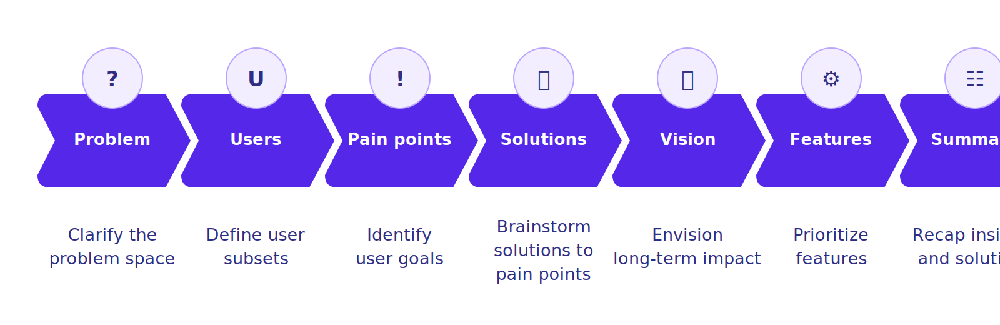
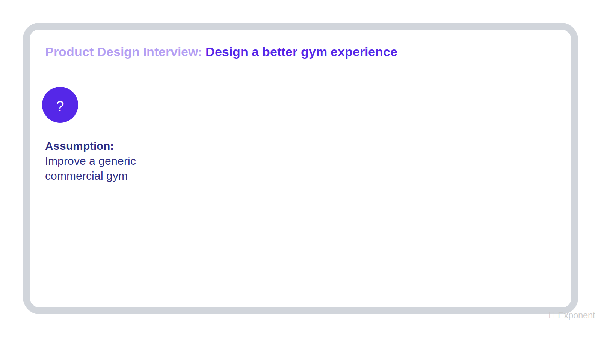
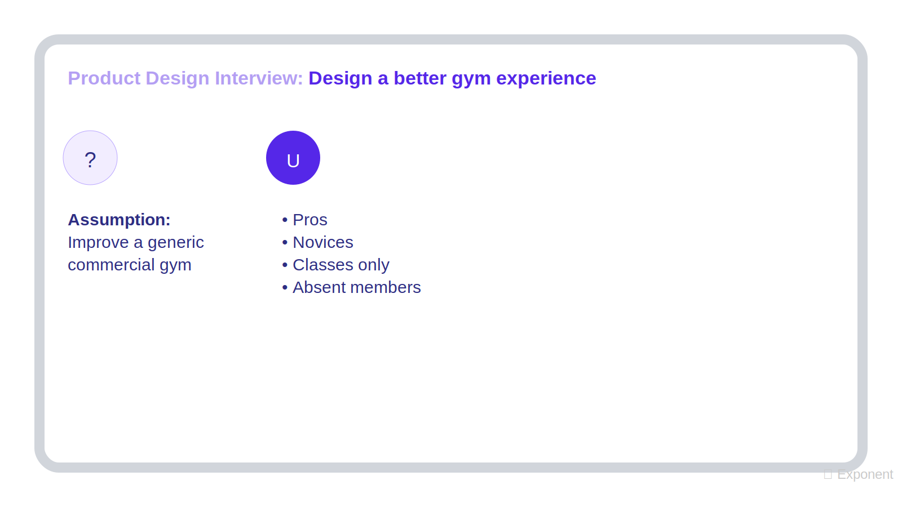
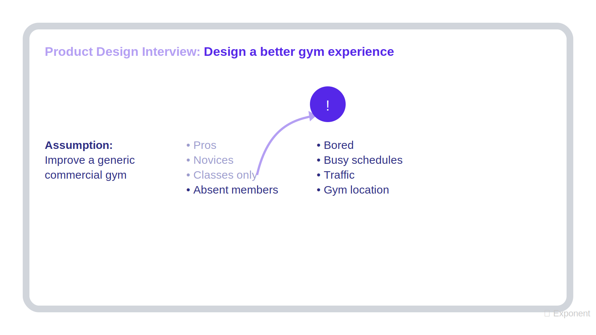
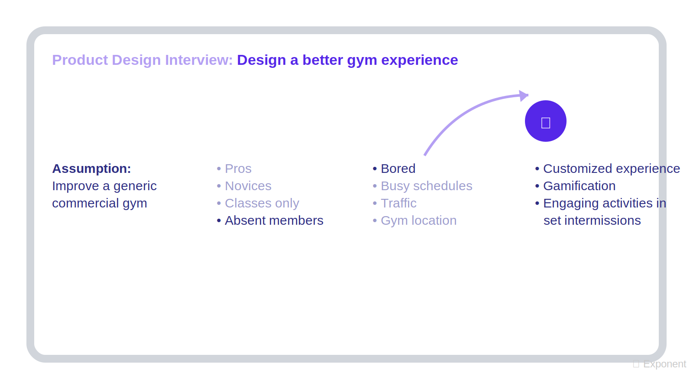
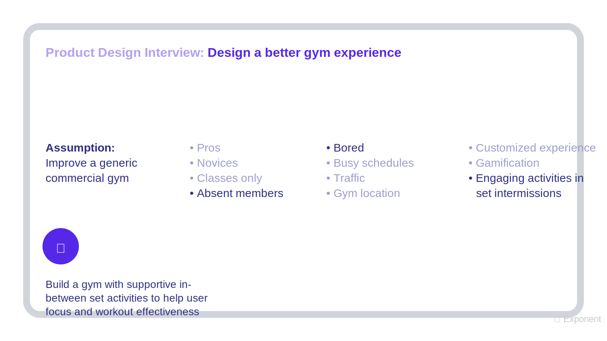
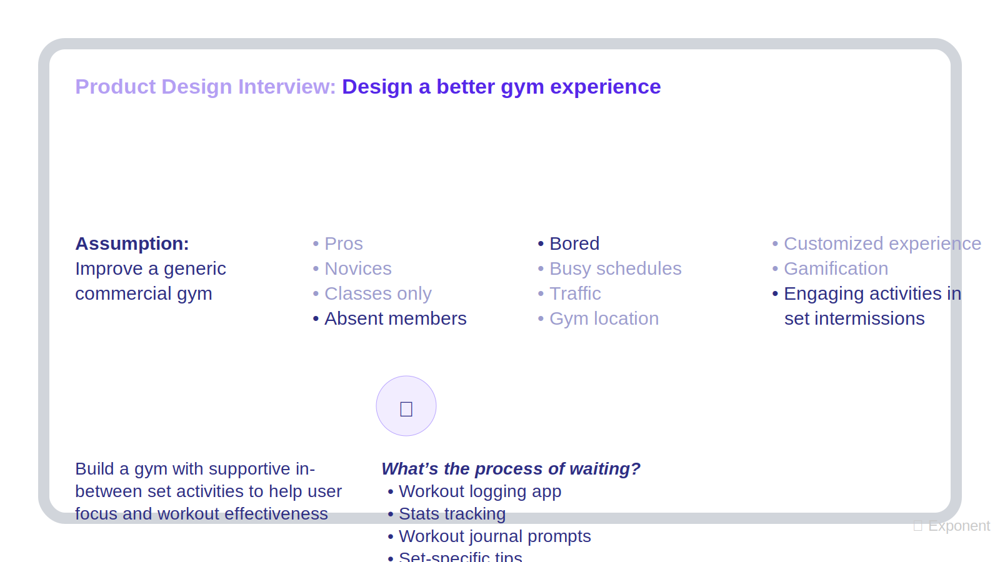
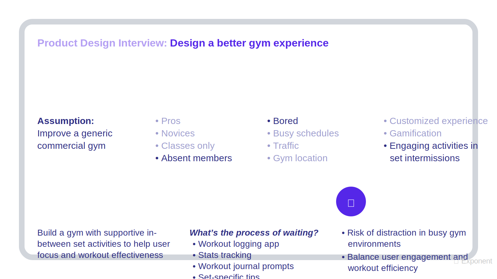

# 如何回答产品设计相关的问题

## 关键概念

| 概念 | 解释 |
| --- | --- |
| 可行产品 | 能真实解决用户问题，同时符合公司逻辑、用户也愿意使用的产品。 |
| 产品愿景 | 对未来产品体验和产品价值的简洁、有记忆点的表达。 |
| 痛点 | 阻碍用户实现目标的具体障碍。 |
| 机会区域 | 用户没有被完全阻挡，但存在摩擦或未被满足需求的地方。 |
| Moonshot | 超越渐进式改进的大胆方案，试图用变革性方式解决根本问题。 |
| 5 Whys | 连续追问“为什么”的方法，用来挖掘问题更深层的根因。 |

## 产品设计题在问什么

产品设计类题目要求你设计或改进某种产品。

常见题型包括：

- 设计一款产品：“设计一款帮助求职者与雇主匹配的应用程序。”
- 改进一款产品：“改进 Headspace。”
- 为特定受众设计：“为盲人设计自动售货机。”
- Moonshot 大胆设想：Google 常见题型，例如“假设你拥有无限资源，请设计 X。”

总体而言，你的目标是在题目的限制条件下设计出一种可行产品。

这里的“可行”意味着：

- 产品解决真实用户问题。
- 解决方案对公司来说合理。
- 用户会喜欢或采用这个方案。
- 想法足够具体，可以被评估。
- 取舍是现实的。

这类题通常需要 25 分钟，不包括 follow-up。面试官常在早期用产品设计题筛掉缺乏基本产品能力的候选人，但它们在 onsite 面试中也很常见。在标准 PM 面试 loop 中，你可能会回答好几道。

## 7 步框架

一个扎实流程是：先澄清问题，收集背景，理解用户和挑战，探索解决方案，选择最佳方向，并为答案提供论证。

| 步骤 | 目的 |
| --- | --- |
| 1. 明确需求并了解背景 | 理解问题空间、限制条件和战略背景。 |
| 2. 定义用户 | 细分用户，并选择值得深入分析的用户群体。 |
| 3. 找出痛点和机会区域 | 理解用户目标，以及什么阻碍或困扰他们。 |
| 4. 头脑风暴解决方案 | 围绕选定痛点生成多个解决方案。 |
| 5. 定义产品愿景 | 把最强想法变成有记忆点的长期方向。 |
| 6. 确定功能优先级 | 选择最能支撑愿景和用户旅程的功能。 |
| 7. 评估与总结 | 总结设计、取舍、风险和下一步。 |

## 示例题

我们用这个问题来演示：

> 设计一种更好的健身体验。

## Step 1: 明确需求并了解背景

首先，澄清题目中的模糊之处。在明确不清楚的公司名和关键词后，继续收集背景信息，帮助你理解问题空间，并确定可能影响设计的战略因素。

有用的澄清问题包括：

- 你说的“gym experience”具体指什么？
- “更好”是什么意思？
- 我们是否想提升某些具体指标？
- 时间安排是什么？
- 有哪些限制条件需要注意？
- 我是在改进家用健身产品，还是商业健身房？
- 我是在改进某一个健身房地点，还是整个连锁？
- 我是在改进 Planet Fitness 这类特定健身房，还是做一般性改进？

面试官可能只给模糊回答。如果是这样，你可以做出假设，并清楚告诉面试官，让对方有机会纠正你。

#### Example Callout

对于“设计一种更好的健身体验”，假设面试官说：

- “你可以自行做假设。”
- “我们只知道健身房体验对一些用户有效，但对另一些用户无效。”
- “我们希望让更多用户获得更好的体验。”

你可以说：

> 接下来我会假设，我们正在改进一家普通商业健身房。

## Step 2: 定义用户

接下来，把总体用户群体切分成若干子群体，并选择一个有意思的群体深入分析。

常见用户细分方式包括：

- 人口统计特征，例如年龄或收入。
- 行为特征，例如使用频率或是否完成某些目标行为。
- 地理位置。
- 客户成熟度，例如新用户、轻度用户、重度用户或流失风险用户。
- 动机，例如社交、健康、效率或娱乐目标。

好的答案会用对当前题目有意义的方式细分用户。一个有用技巧是：切分那些需求明显不同的用户。

列出用户群体后，选择一个并说明为什么值得讨论。可以考虑：

- 战略价值，例如早期采用者或高增长用户。
- 影响规模。
- 痛点深度。
- 公司是否有能力服务这个群体。

#### Example Callout

对于健身房例子，可以按使用情况细分：

- 专业用户。
- 新手用户。
- 只参加课程的用户。
- 有会员资格但不去健身房的用户。

目标用户：

> 有会员资格但不去健身房的人很值得深入分析，因为他们显然遇到了障碍。他们有动力办卡并付费，但某些因素阻止他们真正去健身。如果解决这个问题，我们也可能为其他健身用户创造价值，甚至吸引新会员。

## Step 3: 找出痛点和机会区域

思考你选择的用户可能有什么目标。

明确阻碍用户实现目标的因素就是痛点。如果用户没有被完全阻挡，但存在摩擦，那么你发现的是机会区域。

站在用户角度问：

- 用户想完成什么？
- 这个目标为什么重要？
- 什么让目标变难？
- 这个目标紧迫吗？
- 用户做出的决策重要还是琐碎？
- 有哪些情感、物流、财务或社交障碍？

#### Note Callout

使用“先广后深”小框架：

- 先广：列出尽可能多的用户目标、痛点和摩擦。
- 后深：选择最重要的痛点深入分析。

这能体现用户同理心，也能避免过早锁定一个显而易见但不一定最好的答案。

#### Example Callout

不去健身房的会员当初买会员时，可能有这些目标：

- 变得更健康。
- 看起来更好。
- 增强自信。
- 交朋友或至少保持社交。

可能阻碍他们的因素包括：

- 在健身房感到不自在或被吓到。
- 感到无聊。
- 日程繁忙。
- 交通问题。
- 健身房地点不方便。

你可以选择先解决情感障碍，而不是物流障碍，因为物流问题因人而异，通常更难用一个通用方案解决。

选定痛点：

> 用户可能在健身房感到无聊，尤其是在高峰期等待热门器械的时候。

## Step 4: 头脑风暴解决方案

现在，围绕选定痛点头脑风暴解决方案。

进入下一步前，至少生成三个扎实想法。你可以先列更多，再剔除弱方案。

每个想法都要对照痛点检查，不要害怕发挥创造力。面试官希望看到你对产品有热情。

一个有效方法是想想你喜欢的产品，尤其是那些在其他场景中解决类似问题的产品。

在健身房例子中，Duolingo 是一个有用类比：

- 它帮助人提升自己。
- 它降低动力和习惯门槛。
- 它有趣、容易使用。
- 它强调持续性，而不是短期高强度。

这些特点可以启发更好的健身房体验设计。

#### Example Callout

针对等待器械时感到无聊的用户，可能方案包括：

- 一个考虑高峰时段的训练推荐系统。
- 将健身体验游戏化，让用户整体更投入。
- 专门为组间休息时间设计互动活动。

## Step 5: 定义前瞻性产品愿景

从上一步中选择最强方案，想象这个产品五年或十年后会是什么样。

给它一个简短、有记忆点的 tagline。你希望面试官在评分时能记住这句话。

如果使用白板，可以把愿景写下来，并在后续讨论中不断回到它。

#### Example Callout

健身房的前瞻性愿景可以是：

> 一次健身房访问不只由真正运动的时间组成。非运动时间通常尴尬或无聊。在未来健身房里，这段时间可以变得有趣而令人兴奋。

简洁产品愿景：

> 让我们打造一家健身房，在每组训练之间提供有趣的活动，帮助用户保持正确心态，并获得更有效的训练。

## Step 6: 确定功能优先级

有了有说服力的产品愿景后，就需要确定功能优先级。

建议带面试官快速走一遍用户旅程，说明用户如何与你的产品互动。这能帮助你具体说明产品如何融入现有流程，也能让答案保持以用户为中心。

然后，根据使用场景列出功能，并按它们对产品愿景的支持程度排序。

有用的优先级维度包括：

- 规模：能帮助多少用户？
- 扩展性：能否扩展到其他用户群体？能否吸引新用户？
- 战略影响：是否支持公司愿景？
- 痛点匹配：是否直接解决选定痛点？
- 可行性：是否现实可建、可运营？

你不需要详细描述每个功能的所有细节。但面试官希望你说明用户看见什么、操作什么，以及功能如何实现你设定的目标和愿景。

#### Example Callout

对健身房例子，问自己：

> 等待的过程是什么样的？

用户通常是在等器械，或在组间休息。产品只有一个很短窗口，也许五到十分钟，需要让用户保持投入，但不能让他们从训练中分心。

可能功能：

- 训练记录 app。
- 数据追踪。
- 训练日志提示。
- 下一组动作的技巧和建议。

## Step 7: 评估与总结

最后，总结你的洞察和设计，再评估方案并讨论下一步。

需要考虑：

- 你做了哪些取舍。
- 其他使用场景。
- 边缘情况。
- 如果时间更多，你会如何调整。
- 风险。
- 实施挑战。
- 成功指标。

常见 follow-up 包括：

- “你认为这个设计有什么风险？”
- “你预计实施这个产品会遇到哪些挑战？”

主动讨论风险，能说明你的想法不是空中楼阁，而是扎根现实。

#### Example Callout

对健身房方案：

> 一个风险是健身房人多且有重型器械，如果用户太分心，可能会有危险。我们也要确保这个方案不会拖慢训练，或制造更多瓶颈。

## 回答产品设计题的技巧

### 考虑公司战略

把战略因素加入思考，可以让你更全面、更深入地理解问题。

提示问题：

- 公司使命：公司的使命是什么？为什么公司关心这个领域？这个产品如何支持使命？
- 公司战略：公司可能有什么战略目标？这个产品如何支持这些目标，或打开新的战略方向？
- 市场理解：市场上已有替代方案是什么？缺口在哪里？这个市场中什么有价值？

### 通过抽象问题回答 Moonshot 题

Moonshot 是超越渐进式改进的大胆想法。这类题常见于 Google 面试，但任何设计题都可以通过挖掘根本问题来做出 moonshot 感。

如果你的方案能简单、彻底地为用户解决问题，你就在正确方向上。如果你还能消除导致问题产生的条件，那就更好。

两种有用策略：

1. 把产品看作黑箱。

输入是用户当前状态，输出是用户想达到的状态。先去掉关于“用户必须如何从当前状态到目标状态”的假设，再探索更有变革性的方案。

2. 使用 5 Whys。

不断追问“为什么”，直到挖出根本问题。

例如，如果题目是为聋人用户设计闹钟，用户真正目标不是“使用闹钟”，而是“在特定时间醒来”。这个框架能打开超越传统闹钟改造的新选项。

### 改进现有产品时考虑现有用户

“改进 Instagram home tab” 这类问题和设计新产品类似，但你必须考虑：

- 现有用户。
- 现有产品目标。
- 当前用户预期。
- 市场动态。
- 战略机会。

常见改进方向包括：

- 服务未被充分满足的用户。
- 支持新的使用场景。
- 通过产品调整打开新的战略机会。

## 常见错误

| 错误 | 为什么有害 | 更好的做法 |
| --- | --- | --- |
| 直接跳到解决方案 | 面试官看不到你如何思考，也不知道为什么方案好。 | 解释推理过程，在探索中保持开放。 |
| 忘记细分用户 | 宽泛用户会掩盖真实需求。 | 即使题目给了约束，也要继续细分。例如“为儿童设计 Gmail”还可以按年龄段或学段细分。 |
| 试图为所有人设计 | 最后容易做出没人真正关心的东西。 | 缩小范围，让用户洞察变得具体。 |
| 机械完成框架步骤 | 答案会像 checklist，容易错过洞察。 | 把框架当辅助，而不是必须打勾的清单；每一步都要整体思考。 |

## 30 秒总结

回答产品设计题时，先澄清问题，再定义用户，识别痛点，头脑风暴解决方案，提出产品愿景，确定功能优先级，最后评估取舍。以健身房题为例，我会假设改进普通商业健身房，按使用情况细分用户，选择有会员但不去健身房的用户，识别无聊和被吓到等障碍，提出个性化推荐、游戏化、组间活动等方案，再定义一个让非运动时间也有趣且有效的健身房愿景。最后围绕用户旅程排序功能，并讨论分心、安全和训练瓶颈等风险。
