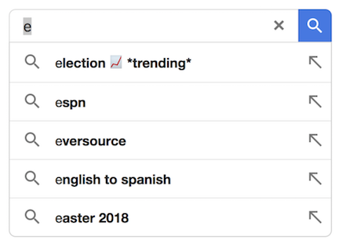
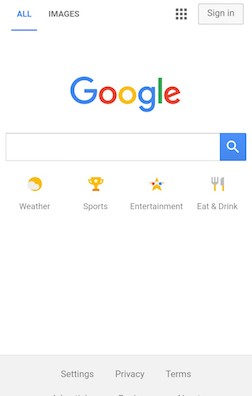

# 对 Google 移动端主页进行 A/B 测试

## 关键术语

| 术语 | 含义 |
| --- | --- |
| A/B 测试 | 对照实验，用来比较当前体验和改动体验的效果。 |
| 搜索流量 | 从 Google 移动端主页产生的搜索行为。 |
| 点击率（CTR，Click-Through Rate） | 通常等于点击次数除以曝光次数。 |
| 跳出率 | 用户到达页面后没有完成目标行为就离开的比例。 |
| 空状态 | 用户还没有输入或选择任何内容时，输入框或界面所处的状态。 |
| 自动建议 | 帮助用户构造或补全查询的搜索建议。 |
| Google Doodle | Google 临时替换的主题 logo，常用于品牌、教育或文化时刻。 |

## 题目

为了增加搜索流量，你会在 Google 移动端主页上开展哪些 A/B 测试？

这道题默认用户已经到达 Google 主页。目标是让用户开始搜索，而不是跳出到其他网站。

## 提示

在运行任何 A/B 测试之前，先把实验定义清楚。可以把 A/B 测试看作科学实验：

- 假设：我们认为会发生什么？
- 方法：我们如何验证？
- 分析：结果如何帮助产品决策？

本题的目标已经给出：增加搜索流量。一个简单例子是让搜索框变得更大、更显眼。

如果卡住，可以从用户视角思考：用户到了 Google 主页后，为什么会离开？

- 他们可能没有注意到如何开始搜索。
- 他们可能不知道如何组织查询。
- 他们可能不知道 Google 可以回答某些类别的需求，比如天气。

## 需要回答的挑战

对每个实验，都要回答：

1. 假设是什么？为什么合理？
2. 关注哪些指标？
3. 预期每个指标如何变化？
4. 指标变化如何影响产品决策？
5. 上线前还需要考虑哪些非实验数据因素？

## 答题结构

每个实验都可以使用 A/B 测试五段式结构：

| 组成部分 | 要覆盖什么 |
| --- | --- |
| 假设 | 对实验结果的初始判断。 |
| 方法 | 如何测试假设，包括对照组和实验组。 |
| 指标 | 需要衡量什么。 |
| 影响 | 结果如何影响产品决策。 |
| 权衡 | 哪些风险不一定能从实验数据里直接看出来。 |

## 头脑风暴：可以改哪些元素？

先列出移动端主页上可以调整的元素：

- Google logo。
- 搜索框。
- 搜索按钮。
- 页脚。
- 个人资料图标。
- 背景。

这个步骤能帮助我们找到可操作的产品杠杆。

## 实验 1：让搜索框更显眼

### 假设

用户可能没有足够注意到搜索框。让搜索框更醒目，应该能提升搜索相关互动。

这个假设合理，因为 Google 移动端主页可能相对拥挤，页面上有多个按钮和图标。

### 方法

设计一个实验组版本，强化搜索框存在感：

- 加粗搜索框边框。
- 给搜索框增加轻微颜色或对比度。
- 让搜索按钮更粗、更大。

在这道面试题中，可以把所有用户都作为实验对象。在其他 A/B 测试题中，可能需要更细的用户分层。

### 指标

| 指标 | 预期方向 | 为什么重要 |
| --- | --- | --- |
| 搜索框点击率 | 上升 | 说明更多用户开始和主要搜索入口互动。 |
| 每次曝光后由搜索框发起的搜索数 | 上升 | 衡量真实搜索流量，而不只是点击或聚焦。 |
| 页面其他元素点击率 | 可能下降 | 检查新设计是否抢走其他重要元素的注意力。 |
| 跳出率 | 不应明显上升 | 如果上升，可能说明新设计让用户困惑并离开 Google。 |

### 影响

如果前两个指标上升，且跳出率稳定，这个实验组就是较强的上线候选。其他元素点击率下降不一定不可接受，关键是整体搜索流量是否净提升，同时没有伤害重要体验。

### 权衡

即使实验成功，也要考虑定性层面的取舍：

- 用户可能更少使用图片搜索或其他搜索模式。
- 页面可能过度把用户导向单一路径。
- 用户可能更少注意 Google Doodle。
- Doodle 参与下降可能伤害 Google 作为创意、教育型公司的品牌表达。

## 实验 2：更丰富的空状态查询建议

### 假设

有些用户到达 Google 主页后，不知道如何组织自己需要的查询。当用户点击搜索框时，提供更丰富的空状态建议，可以降低放弃率，并增加搜索流量。

### 方法

当用户点击搜索框时，显示更丰富的空状态自动建议。空状态指搜索框已经激活、但用户还没有输入任何内容。

可以从简单版本开始：

- 用户点击搜索框后，展示有帮助的搜索选项。
- 把一个热门搜索词放在建议列表顶部。
- 例如热门查询：“Donald Trump Election”。

### 指标

| 指标 | 预期方向 | 为什么重要 |
| --- | --- | --- |
| 点击搜索框后的放弃率 | 下降 | 说明更少用户在开始搜索后放弃。 |
| 新热门建议的点击率 | 从零开始上升 | 衡量用户是否使用新建议。 |
| 其他建议查询的点击率 | 不应明显下降 | 确认新建议没有挤掉更有价值的建议。 |
| 建议查询整体点击量 | 上升 | 确认搜索行为有净增长。 |

### 影响

只有当新热门建议带来搜索指标净提升时，才值得上线。如果热门建议点击率明显低于其他建议，或整体建议点击下降，就不应该上线。

### 权衡

一个主要风险是不合适的热门查询建议。例如，暴力或令人不适的新闻可能正在流行，用户可能会在 Google 主页上看到令人不安的内容。

上线前，需要确保安全和反滥用系统能可靠识别并过滤不合适内容。

## 实验 3：在主页添加快捷链接

这项实验对应 Google 移动端主页上真实上线过的新功能。

### 假设

用户可能不知道如何搜索，也不知道 Google 支持很多实用搜索类别。把有用内容类别直接展示在主页上，可以帮助用户发现功能并开始搜索。

例如：

- 用户可能不知道可以直接在 Google 查天气。
- 一个可见的天气快捷入口，可以帮助用户发现并启动这个查询。

### 方法

在搜索框下方设计一组情境化图标：

- 天气。
- 体育。
- 娱乐。
- 餐饮。
- 其他有用查询类别。

这些图标可以从更大的有用查询集合中动态更新。如果用户点击娱乐，可以继续展示更多娱乐相关查询。

### 指标

| 指标 | 预期方向 | 为什么重要 |
| --- | --- | --- |
| 各快捷图标点击率 | 从零开始上升 | 衡量用户是否使用新入口。 |
| 点击图标后的搜索参与 | 提升 | 包括放弃率、后续查询次数等。 |
| 搜索框点击率 | 小幅下降可以接受 | 用户可能把部分输入行为转移到快捷入口。 |
| 主页整体交互率 | 上升 | 目标是增加移动端主页上的搜索相关互动。 |

### 影响

如果搜索框交互率下降幅度大于图标点击带来的收益，就不应该上线。理想情况是搜索框使用率略微下降，但图标点击率大幅提升，从而让整体交互率净增长。

### 权衡

用户可能习惯点击图标，而不是输入更丰富的查询。比如，正常情况下用户会搜索“明天天气”或“缅因州天气”，但点击图标时可能只搜索泛泛的“天气”。

如果用户长期变得不愿表达更具体查询，这可能会对 Google 搜索留存产生负面影响。

## 三个实验对比

| 实验 | 复杂度 | 主要收益 | 主要风险 |
| --- | --- | --- | --- |
| 让搜索框更显眼 | 低 | 更多用户直接开始搜索。 | 其他主页元素获得更少注意。 |
| 更丰富的空状态查询建议 | 中 | 帮助不知道该输入什么的用户开始搜索。 | 热门建议可能不合适。 |
| 添加快捷链接 | 高 | 帮助用户发现有用搜索类别。 | 用户可能依赖浅层快捷入口，而不是输入更丰富查询。 |

## 总结

这三个实验都可以成为好答案，前提是你讨论得足够具体，并提前考虑风险。最佳答案不一定是最复杂的想法，而是清晰、可测试、高影响，并且诚实讨论取舍的方案。
