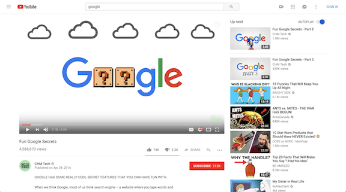

# Pick YouTube's Key Metrics

## 中文标题

选择 YouTube 的关键指标

## Source

Exponent practice question

## Question Type

Metrics question

## Related Framework

GAME framework:

- Goals
- Actions
- Metrics
- Evaluate

Note: This practice solution uses GAME without an explicit Clarify step. In an actual interview, briefly clarify scope first.

## Image Asset

Use the original YouTube screenshot provided with this exercise for the future website.

Expected path:

- `product-sense/assets/images/analytical-questions/exercises/youtube-key-metrics.png`

## Abbreviations and Terms

- PM: Product Manager，产品经理。
- North star metric: 北极星指标，体现产品核心价值、可粗略衡量产品成功的关键指标。
- GAME framework: 指标题回答框架。完整版本是 Clarify, Goals, Actions, Metrics, Evaluate；本文示例主要使用 Goals, Actions, Metrics, Evaluate。
- Sentiment analysis: 情感分析，用自然语言处理方法判断文本倾向是正面、负面还是中性。
- Watch time: 观看时长。

## Original and Refined Notes

### Question

#### Original

Pick YouTube's Key Metrics

Question

You’re the PM of YouTube’s Analytics. What would you pick as the three key metrics, and why?

As with many PM questions, this one doesn’t have a single answer. Give a reasonable answer and defend your perspective.

#### 中文润色

选择 YouTube 的关键指标

问题：

你是 YouTube Analytics 的 PM。你会选择哪三个关键指标？为什么？

和许多 PM 面试题一样，这道题没有唯一正确答案。你需要给出一个合理答案，并为自己的观点辩护。

#### 复习注解

这题不是考“背 YouTube 的官方指标”，而是考你能不能：

- 定义 YouTube 的产品目标。
- 找出支持目标的用户行为。
- 把行为转化成明确指标。
- 解释为什么这三个指标比其他指标更合适。
- 说明指标的盲点和 guardrails。

### Solution: Approach

#### Original

Solution

Approach

This is a typical product management metrics question. Generally, there's never any single metric that's the best metric to optimize for. Product managers often name these top metrics their product's "north star" metrics. North star metrics are metrics that capture the core value of your product, and are worth using as a rough litmus test for the success of your product.

In this question, let's use the GAME framework, which is quite simple and effective. We want to:

Goal: Define goals for the product. What is our product vision? Where do we see the product growing in the next five years? For example, if we're working at Whatsapp, perhaps our overall goal is to see the platform grow in terms of user retention. We want to ensure that users who visit our platform discover useful features and stay on the platform.

Actions: What actions do we want our users to take that support these goals? For instance, which features or actions drive engagement? Maybe we want our users to send at least one message per day, since these users often stay on the platform for several months. Another reasonable action to consider here is payment - how many users upgrade their accounts?

Metrics: Now that we've clarified our actions of interest, let's discuss which metrics capture these actions. For example, we can track the number of users that upgrade their account to premium, or the number of users who send one message per day for one week. Tracking these metrics helps indicate to us if our users are taking the Actions that align with our product's Goals.

Evaluate: Of course, as with most PM questions, reflect after you deliver your answer. How might this metric be a false-positive or false-negative? What are some cases where your defined metrics may show positive, but cause deleterious effects for the platform? For instance, perhaps users are upgrading their accounts to premium, but then, after a few days, refunding their purchase because of dissatisfaction with the premium account. These false-positives or false-negatives don't mean that your answer is wrong - it's just always worth mentioning the tradeoffs and potential areas of concern with your selected metric. In fact, no single metric will ever be foolproof!

#### 中文润色

这是一个典型的产品管理指标题。通常不存在某一个永远最适合优化的指标。产品经理经常把最重要的一组指标称为产品的 north star metrics。North star metrics 应该捕捉产品的核心价值，并可以作为粗略判断产品是否成功的 litmus test。

这道题可以使用 GAME framework。它简单而有效。我们要做的是：

Goal：定义产品目标。我们的产品愿景是什么？未来五年希望产品在哪些方面增长？例如，如果我们在 WhatsApp 工作，总体目标可能是提高用户留存。我们希望访问平台的用户能发现有用功能，并持续留在平台上。

Actions：哪些用户行为支持这些目标？例如，哪些功能或行为能驱动 engagement？也许我们希望用户每天至少发送一条消息，因为这类用户往往会在平台上留存几个月。另一个可考虑的行为是 payment：有多少用户升级账户？

Metrics：明确关注的 actions 后，就要讨论哪些指标能捕捉这些 actions。例如，我们可以追踪升级为 premium 的用户数量，或者一周内每天至少发送一条消息的用户数量。追踪这些指标能帮助我们判断用户是否采取了与产品目标一致的 actions。

Evaluate：和大多数 PM 问题一样，给出答案后还要反思。这个指标是否可能产生 false positive 或 false negative？在哪些情况下，指标看起来是正向的，却会对平台产生负面影响？例如，用户可能升级到 premium，但几天后因为不满意而退款。这些误报或漏报不代表答案错误；它们说明你应该主动指出所选指标的 tradeoffs 和潜在风险。事实上，没有任何单一指标是 foolproof 的。

#### 复习注解

这段可以转化为面试回答的主线：

1. 先说明没有唯一正确答案。
2. 用 GAME 建结构。
3. 把 YouTube 的目标定义为 engagement。
4. 从用户行为中筛出最能代表 engagement 的 actions。
5. 给出三个 per-user average metrics。
6. 评估 watch time 和 comments 的风险。

### Goal

#### Original

Goal

First, let's define the overall goal for YouTube as a company. There are a variety of goals we can select, and they would all be great answers. Overall, YouTube's goal is to provide entertaining and educational video content to users. YouTube also has a subscription plan, called YouTube Premium, that charges users a monthly subscription fee to access premium and ad-free content. Some reasonable goals include user retention, user engagement, or more video upload time. In this case, we'll select user engagement as the key metric - YouTube wants to see its users getting the most out of the platform.

Note: Generally, revenue is NOT a recommended goal. Companies who focus solely on revenue fail to consider that user experience is a more important health metric for the overall company. First and foremost, deliver an incredible and worthwhile user experience. Then, you can consider monetization metrics.

图片一

#### 中文润色

首先，定义 YouTube 作为公司的总体目标。可以选择多种合理目标，它们都可能是好答案。总体来说，YouTube 的目标是向用户提供娱乐性和教育性的视频内容。

YouTube 也有订阅服务 YouTube Premium，用户每月付费后可以访问 premium 和 ad-free content。合理目标可以包括 user retention、user engagement 或更多 video upload time。

在这个答案中，我们选择 user engagement 作为关键方向，因为 YouTube 希望看到用户充分利用平台。

#### Note Callout

Type: note

Generally, revenue is NOT a recommended goal. Companies who focus solely on revenue fail to consider that user experience is a more important health metric for the overall company. First and foremost, deliver an incredible and worthwhile user experience. Then, you can consider monetization metrics.

中文理解：通常不建议把 revenue 作为唯一目标。只关注收入会忽略用户体验，而用户体验往往是公司整体健康度更重要的指标。应先提供出色且值得用户投入时间的体验，再考虑 monetization metrics。

### Actions

#### Original

Actions

So, what user actions align with the goal of user engagement? Here are some to start with:

Likes on videos

Watching videos

Commenting on videos

Clicks on thumbnails of videos

Adding videos to playlists

Creating playlists

Youtube.com domain page visits

All of these are high-level actions that would indicate engagement on the platform. It's important to consider a high-level analysis of actions prior to diving into the nitty gritty metrics, else you may miss important details and skip some steps to clearly explain your answer.

#### 中文润色

那么，哪些用户行为与 user engagement 这个目标一致？可以从以下 actions 开始：

- 视频点赞。
- 观看视频。
- 评论视频。
- 点击视频缩略图。
- 将视频加入播放列表。
- 创建播放列表。
- 访问 Youtube.com 页面。

这些都是能够体现平台 engagement 的高层行为。在深入具体指标之前，先从较高层次分析 actions 很重要。否则你可能遗漏重要细节，也可能跳过解释答案所需的中间步骤。

### Metrics

#### Original

Metrics

Now, our goal is to take some of the above actions, determine which ones are most important to us, and define clear metrics that capture these actions.

In this case, the most desired user actions are likely:

Likes on videos

Watching videos

Commenting on videos

Playlist metrics, while helpful, are a currently niche feature and don't capture the overall health of YouTube as a platform. Clicks and visits are helpful to determine interest, but the other actions (likes, comments, and watches) give a clearer sense that the user enjoyed and engaged with the content. Now, let's re-define the above actions with respect to metrics. It's important to be precise here.

Average number of likes clicked per user

Average video watch time per user

Average number of comments per user

These metrics are defined as averages based on per-user metrics, to give a clear sense of user engagement.

#### 中文润色

现在，我们要从上面的 actions 中选择一部分，判断哪些对我们最重要，并定义能捕捉这些 actions 的明确指标。

在这个场景里，最重要的用户行为可能是：

- 视频点赞。
- 观看视频。
- 评论视频。

Playlist metrics 虽然有帮助，但它目前更像是 niche feature，无法捕捉 YouTube 作为平台的整体健康度。Clicks 和 visits 有助于判断兴趣，但 likes、comments 和 watches 更能体现用户是否真正喜欢内容并与内容互动。

现在，把这些 actions 重新定义为 metrics。这里必须精确：

- Average number of likes clicked per user。
- Average video watch time per user。
- Average number of comments per user。

这些指标都以 per-user averages 的形式定义，目的是清楚反映用户 engagement。

#### Final Metrics

1. Average number of likes clicked per user.
2. Average video watch time per user.
3. Average number of comments per user.

### Evaluate

#### Original

Evaluate

We've defined three key metrics that give us a sense of actions consistent with our goal of helping YouTube boost its user engagement. Now, let's think of some pitfalls and potential tradeoffs from these metrics to give a complete answer to the interviewer.

One pitfall: comments are not necessarily a positive user metric. While commenting users are engaged users, they may be frustrated, offended, or disgusted with the content they are viewing. To mitigate this concern, it'd be helpful to use sentiment analysis tools for comments to check if these comments are generally positive or negative in nature.

Another pitfall: watch-time isn't necessarily a positive user metric, when taken to the extreme. Of course, it is beneficial to YouTube to have engaged users on the platform, but many users are nearly addicted to their YouTube viewing habits. If users feel like their time spent on YouTube is a waste, or that they can't help but watch YouTube instead of accomplishing their important life tasks, then perhaps YouTube's attractive influence is actually a downside.

#### 中文润色

我们已经定义了三个关键指标，用来衡量与 YouTube 提升 user engagement 目标一致的用户行为。现在，需要思考这些指标的潜在风险和 tradeoffs，这样才能给面试官一个完整答案。

第一个风险：comments 不一定是正向用户指标。发表评论的用户确实是 engaged users，但他们可能是因为感到沮丧、被冒犯，或对内容反感才评论。为了缓解这个问题，可以使用 sentiment analysis tools 分析评论倾向，判断评论整体是正面还是负面。

第二个风险：watch time 被推到极端时，也不一定是正向用户指标。YouTube 当然希望用户活跃，但许多用户可能接近沉迷于 YouTube。如果用户觉得自己花在 YouTube 上的时间是浪费，或者觉得无法控制自己、总是看 YouTube 而没有完成生活中重要的事，那么 YouTube 的强吸引力反而可能成为负面因素。

#### 复习注解

这题的 evaluate 部分很关键，因为三个指标都可能被误读：

- Likes：可能受 UI、推荐曝光、创作者引导影响，不一定完全代表高质量内容。
- Watch time：可能代表沉迷、无聊或低效浏览，不一定代表满意。
- Comments：可能是争议、愤怒或负面情绪，不一定代表正向参与。

可补充的 guardrails：

- User satisfaction survey score。
- Negative feedback rate, such as not interested or dislike signals。
- Comment sentiment score。
- Creator ecosystem health。
- Long-term retention。
- Premium churn or refund rate。

## 30-Second Answer

I would define YouTube's goal here as driving healthy user engagement around entertaining and educational video content. The key user actions I care about are watching videos, liking videos, and commenting. So my three metrics would be average video watch time per user, average number of likes clicked per user, and average number of comments per user. I would be careful with these because watch time can reflect addiction or passive browsing, and comments can be negative, so I would pair them with guardrails like comment sentiment, user satisfaction, and long-term retention.

## Tags

youtube, metrics, north-star-metric, game-framework, engagement, watch-time, comments, likes

